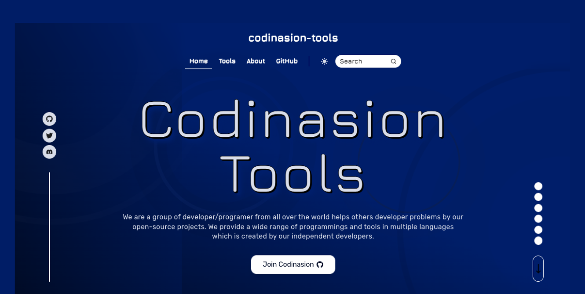

<h1 align="center">Codinasion Tools</h1>

<div align="center">

 

</div>

<p align="center">
A collection of open source tools
</p>



## Table of Contents

- [Table of Contents](#table-of-contents)
- [Introduction](#introduction)
- [Installation](#installation)
- [Usage](#usage)

## Introduction

Codinasion Tools is a collection of open source tools that can be used to help you in your daily activities.

## Installation

```bash
pip install codinasion-tools
```

## Usage

```python
from codinasion_tools import ConvertDecimalToBinary

binary = ConvertDecimalToBinary(10)
print(binary) # 1010
```

---

<p align="center">
Made with 💖 by Codinasion
</p>

---
